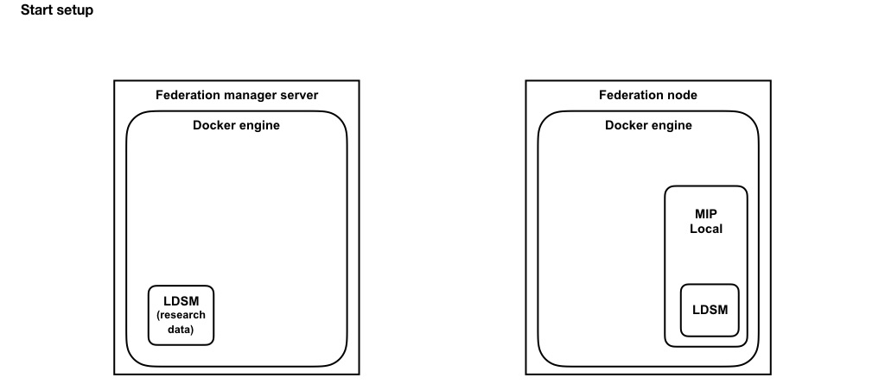
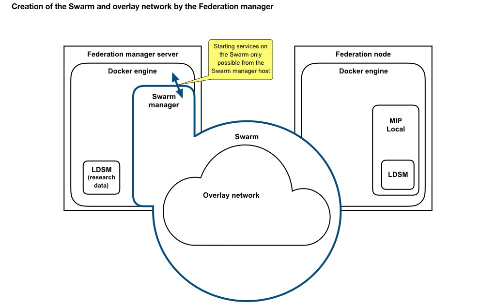
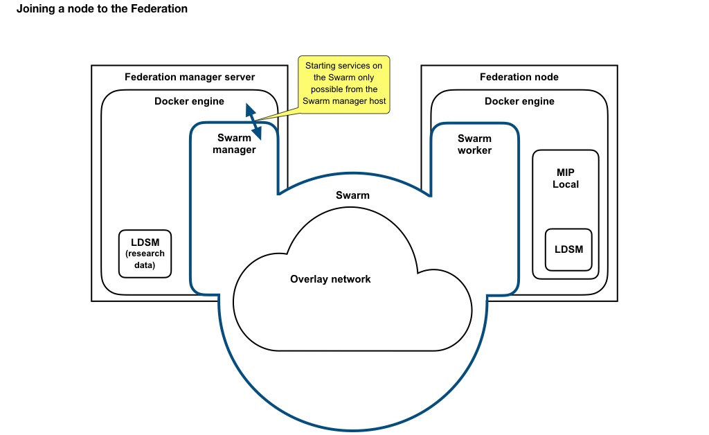
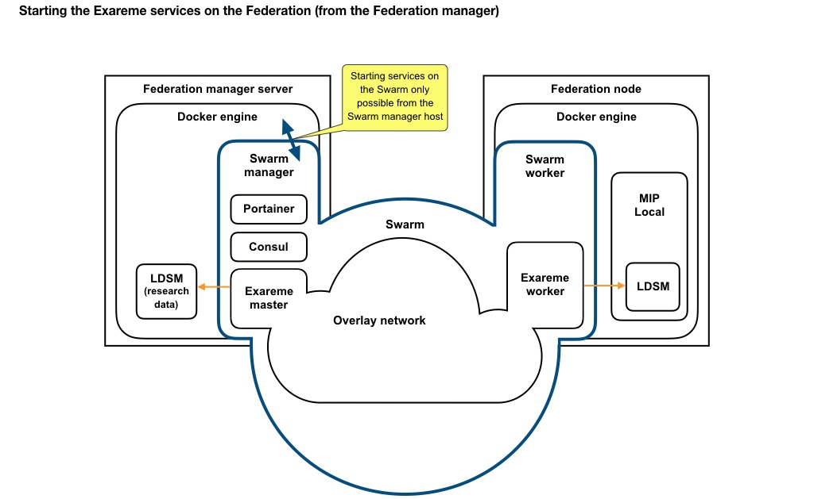
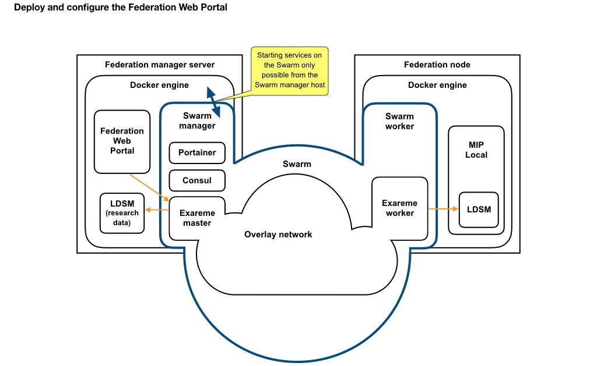

# MIP Federation specifications

Contents:

- [Overview of the Federation](#overview-of-the-federation)
- [MIP Federated requirements](#mip-federated-requirements)
- [MIP Federated deployment](#mip-federated-deployment)
- [Troubleshooting](#troubleshooting)
- [Behaviour in case of failure](#behaviour-in-case-of-failure)
- [Security](#security)

## Overview of the Federation

The MIP Federation allows to connect multiple MIP Local instances securely over the web, so that privacy-preserving analysis and queries on the data hosted at the Federation nodes can be performed in a distributed manner from the Federation manager, using the Exareme software.


### Federation architecture

The following schema shows on overview of the working principle of the Federation and of its infrastructure. The Federation is composed of one or more Federation manager nodes, and of any number of Federation nodes, usually hospitals hosting a MIP Local instance and sharing data on the Federation.


The Federation Manager server will run Docker engine (as all other MIP nodes). It will create the Federation Swarm (standard Docker functionality), which will make it the Swarm manager.

The Federation Manager server will host the following Federation elements (alongside its MIP Local or just LDSM instance):

- Federation Web Portal (container run locally)
- Federation Swarm Manager
- Consul (container run on the swarm)
- Portainer (optional UI for swarm management, container run on the swarm, service published on port 9000)
- Exareme Master (container run on the swarm, service published on port 9090)


The other MIP nodes will host an MIP Local instance, possibly deployed on several servers for improved security. The modifications will be:

- The server dedicated to the Federation (hosting the LDSM) will have an internet access.
- The Data Capture and Data Factory might be moved to other servers to improve security.
- The Federation server (or more accurately its Docker engine instance) will join the Federation Swarm.
- The Federation Swarm Manager will remotely start an Exareme worker on the node.

The software Exareme will expose federated analysis functionalities to the Federation Web Portal. Exareme provides several algorithms that can be performed over the data distributed in multiple nodes. Exareme algorithms retrieve only aggregated results from each node to ensure privacy (no individual patient data will leave the servers of the MIP partners). Exareme then combines the partial results in a statistically significant manner before returning results to the Federation Web Portal.


### Regarding Docker swarm

As written in the official documentation, "Docker includes a _swarm mode_ for natively managing a cluster of Docker Engines called a _swarm_". The Docker swarm functionality creates a link among distant Docker engines. A Docker engine can only be part of one swarm, so all the Docker Engine instances running on the Federation servers will be part of the Federation Swarm. (In other words, the Federation servers cannot be part of another swarm, assuming the normal and recommended setup where only one Docker engine runs on each server.)

The swarm is created by the Swarm Manager; other Federation nodes will join as Swarm Workers. The Federation Swarm Manager will create a `mip-federation` network shared by the swarm nodes. All communications on this network will be encrypted using the option `--opt encrypted`.

Docker containers can be run in two ways: 

- On the swarm. To run on the swarm, the containers must be started **from the Swarm Manager**. Containers started directly on the worker nodes cannot join the swarm for security reasons. This means that all Exareme containers (Master and Worker instances) will be started from the Federation Swarm Manager.
- Outside the swarm. Docker containers running outside the swarm can be started locally as usual on the worker nodes. All Docker services composing MIP Local will be run locally, without access to the swarm or the other MIP nodes.


### Planned Federation infrastructure

A Federation server is planned in the CHUV infrastructure, along with the hospital's MIP node server.

The Federation server host the first Federation Manager node, as well as the Federation Web Portal providing the MIP federated functionalities.


## MIP Federated requirements

### Federation manager server requirements

- Static IP
- Network configuration:
  * TCP: ports 2377 and 7946 must be open and available
  * UDP: ports 4789 and 7946 must be open and available
  * IP protocol 50 (ESP) must be enabled

- If the configuration uses a whitelist of allowed IP addresses, the IP of all other Federation nodes must be authorised.

The Federation manager server must run an instance of the LDSM as deployed in the MIP, exposing a valid federation view. The LDSM instance must be accessible locally through PostgresRAW-UI on port 31555.

- If the Federation Manager server is a hospital node, it will run a normal MIP Local instance.
- If the Federation Manager server is not a hospital node, it only needs to run an instance of the LDSM containing the research datasets which are exposed to the Federation.


### Federation nodes requirements

- Static IP
- Network configuration:
  * TCP: port 7946 must be open and available
  * UDP: ports 4789 and 7946 must be open and available
  * IP protocol 50 (ESP) must be enabled

The node must also host a deployed MIP Local, or at least an LDSM instance. The LDSM instance must be accessible locally through PostgresRAW-UI on port 31555.


## MIP Federated deployment

### Initial setup

This document does not cover the deployment of MIP Local at each node (this is documented [separatly in details](https://github.com/HBPMedical/mip-federation/blob/master/Documentation/MIP_Local_deployment.md)). It does not include either the deployment and configuration of the Federation Web Portal, for which no information is available yet (28.03.2018).

In summary, the initial setup expected is the following:

- On the Federation Manager server, Docker engine must be installed and the LDSM deployed, either alone or as part of the MIP Local (PostgresRaw and PostgresRaw-UI containers configured to expose their services on the port 31432 and 31555 respectively).

- On the other Federation nodes, MIP Local must be deployed including the LDSM, with PostgresRaw and PostgresRaw-UI containers configured to expose their services on the port 31432 and 31555 respectively.

- The network access is configured at each node according to the requirements.



### Deployment of the Federation Manager node

In the MIP Federation setup, the Federation Manager node is a server independent from any particular hospital. Alternatively, any hospital node hosting an instance of MIP Local could be the Federation manager.

In both cases, the Federation Manager server must host a deployed LDSM instance exposing the research data as part of its Federation view.

The Federation Manager server creates the Federation Swarm; it thus becomes the _Swarm Manager_. It also creates a network on the swarm dedicated to the Federation traffic named `mip-federation`. 
At creation time, or any time later, two tokens can be retrieved: they allow to add worker or manager nodes to the swarm.

Note: The Swarm Manager can be located on any server running docker; ideally it should be duplicated on three (or any odd-numbered number of) servers for redundancy. We currently assume that the MIP Federation Server of CHUV will be the Swarm Manager (others can be added later using the "manager" token).

Once the Swarm is created, the Exareme master will be run on the swarm. The Federation Web Portal must be configured to access Exareme on the correct port.


#### Deployment steps

- Create the swarm by running the `setupFederationInfrastructure.sh` script (use `sudo` if docker rights are not available).
  
   ```
   git clone https://github.com/HBPMedical/mip-federation.git
   cd mip-federation
   ./setupFederationInfrastructure.sh
   ```



- If the future Federation nodes have the usual MIP Local settings, create a file `settings.local.sh` with the following content:

    ```
    : ${DB_PORT:="31432"}
    : ${DB_NAME2:="ldsm"}
    : ${DB_USER2:="ldsm"}
    ```
- Tag the manager node with an informative label, using Portainer or the following commands:

   ```sh
   sudo docker node update --label-add name=<node_alias> <node hostname>
   ```
   * `<node hostname>` can be found with `docker node ls`
   * `<node_alias>` will be used when bringing up the services and should be a short descriptive name.

- Create a file named `settings.local.<node_alias>.sh `, which contains the password for the `ldsm` user to connect to the database on the manager node:

    ```
    : ${LDSM_PASSWORD:="<ldsm_user_password_for_db_at_node>"}
    ```

- Start Exareme on the manager node:

   ```sh
   ./start.sh <node_alias>
   ```
   The Exareme test page will be accessible on `http://localhost:9090/exa-view/index.html`.

- Optionally, the web interface Portainer can be deployed to manage the swarm and the services running on it:

    ```
    ./portainer.sh
    ```
    Portainer will be accessible on `http://localhost:9000/` by default.


### Deployment of other MIP nodes

An official version of MIP Local must be deployed normally.

The only supplementary deployment step to perform at the node is to join the swarm, using the token provided by the swarm manager.

#### Deployment steps

- On the Federation manager server, retrieve the join token with the following command:

	```
	sudo docker swarm join-token worker
	```

- On the node, use the command retrieved at the previous step to join the Federation swarm. The command looks like the following:

	```
	docker swarm join --token <Swarm Token> <Master Node URL>
	```





### Deployment of Exareme and creation of the Federation

Once the worker nodes have joined the swarm, they are visible from the manager of the Federation, through Portainer under the "Swarm" tab or running:

```
docker node ls
```

The swarm manager must tag each node with a representative name (e.g. hospital name) and launch an Exareme worker on each of them. The Exareme worker will access the local LDSM to perform the queries requested by the Exareme master.

#### Deployment steps

- On the Federation manager server, tag the new node(s) with an informative label, using Portainer or the following commands:

   ```sh
   sudo docker node update --label-add name=<node_alias> <node hostname>
   ```
   * `<node hostname>` can be found with `docker node ls`
   * `<node_alias>` will be used when bringing up the services and should be a short descriptive name.

- For each node, create a file named `settings.local.<node_alias>.sh `, which contains the password for the `ldsm` user to connect to the database on that specific node:

    ```
    : ${LDSM_PASSWORD:="<ldsm_user_password_for_db_at_node>"}
    ```

- Start Exareme on the new node:

   ```sh
   ./start.sh <node_alias>
   ```




### Deployment and configuration of the Federation Web Portal

To be defined once the Federation Web Portal is available. (As of 29.03.2018, no version integrating Exareme's functionalities is available).




## Troubleshooting

### Network configuration

Obtaining the correct network configuration for each server that must join the Federation might not be straightforward.

#### TCP and UDP ports

The netcat utility can help to check the connections from one Federation server to another (and in particular from the Federation manager):

- Testing that the UDP ports are open: ```nc -z -v -w1 -u <host> <port>```
- Testing that the TCP ports are open: ```nc -z -v -w1 -t <host> <port>```

As an example, here is for all the ports needed by the platform:

```sh
nc -z -v -w1 -t <host> 7946 # if <host> is a worker node
nc -z -v -w1 -t <host> 2377 7946 # if <host> is a manager node
nc -z -v -w1 -u <host> 4789 7946 # for all nodes
```

**Note:** netcat is not installed by default on RHEL; it can be done with the command `sudo yum install nc`. The -z option is not available on RHEL: simply run the commands above without it.

**Note 2:** Alternatively, if you are using `bash` as your command line shell and it was build with the support for it; tcp ports opening can be checked with this command (change tcp for udp to check udp ports):

```
</dev/tcp/<host>/<port> && echo "Port is open and docker is running" || echo "Port is closed and/or docker is not running"
```

#### IP protocol 50

If the firewall configuration for tcp and udp ports is correct, but IP protocol 50 (ESP) is not enabled at a node, it will be possible to start the Exareme master and workers, but they will not be able to communicate among themselves. This is because the protocol 50 is used when securing overlay networks over the swarm.


### Check that all workers are seen by Exareme

Connect to the Exareme test page at `http://localhost:9090/exa-view/index.html`. The algorithm WP\_LIST\_DATASETS should show the datasets available at each node of the Federation.

If a node dataset is missing:

- Check the network configuration for this node.
- Check that the parameters to access the node's database are correctly set.
- Make sure the worker node has joined the swarm and that it is tagged with a proper name.
- Try to stop and restart Exareme on all nodes (see below).
- If this does not solve the problem, check the logs and report the problem.

### Exareme failure

Simply restart all Exareme instances from the manager node:

```
./stop.sh all
./start.sh all
```

## Behaviour in case of failure

The Swarm functionality of Docker is meant to orchestrate tasks in an unstable environment: "Swarm is resilient to failures and the swarm can recover from any number of temporary node failures (machine reboots or crash with restart) or other transient errors."

If a node crashes or reboots for any reason, docker will re-join the swarm automatically when restarted. The manager will then restart the missing services on the swarm and try and restore the previous status as soon as possible.

Currently, Exareme will not work properly if all the expected worker nodes are not available, or if their IP addresses on the overlay network are modified (which is usually the case when a worker restarts). In case of prolonged unavailability or failure of one worker node, Exareme should be restarted to adapt to the new status.

**Further developments of Exareme are under way, this status (corresponding to version v8) should evolve in the near future.**

The swarm cannot recover if it definitively loses its manager (or quorum of manager) because of "data corruption or hardware failures". In this case, the only option will be to remove the previous swarm and build a new one, meaning that each node will have to perform a "join" command again, unless the docker swarm folders where properly [backed up](#back-up-the-swarm).

To increase stability, the manager role can be duplicated on several nodes (including worker nodes). For more information, see Docker documentation about [adding a manager node](https://docs.docker.com/engine/swarm/join-nodes/#join-as-a-manager-node") and [fault tolerance](https://docs.docker.com/engine/swarm/admin_guide/#add-manager-nodes-for-fault-tolerance").

A worker node can leave the swarm using this command:

```
docker swarm leave
```

The manager must then remove that node from the known workers:

```
docker node ls
docker node rm <hostname>
```


## Security

This section documents a few elements regarding security.

### Swarm join tokens

The tokens allowing one node to join the swarm as a worker or a manager should not be made public. Joining the swarm as a manager, in particular, allows one node to control everything on the swarm. Ideally, the tokens should not leave the manager node except when a new node must join the swarm. There is no need to store these token somewhere else, as they can always be retrieved from the manager node.

Furthermore, the tokens can be changed (without impacting the nodes already in the swarm), following the documentation available <a href="https://docs.docker.com/engine/swarm/swarm-mode/#view-the-join-command-or-update-a-swarm-join-token">here</a>. It is recommended to rotate the tokens on a regular basis to improve security.


### Back up the Swarm

See documentation <a href="https://docs.docker.com/engine/swarm/admin_guide/#back-up-the-swarm">here</a>.
